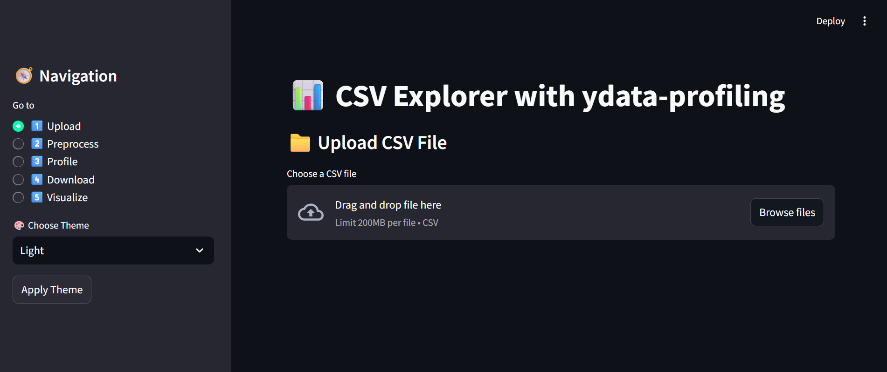
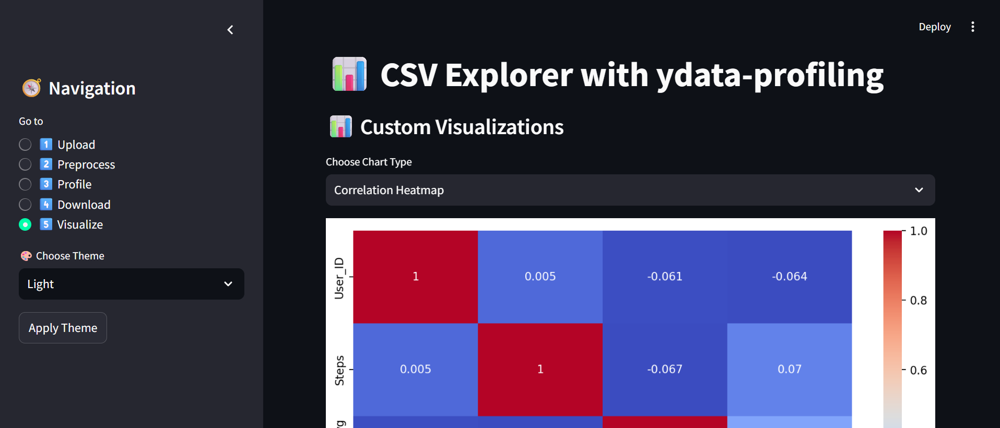

# 📊 Streamlit Excel Analyzer

A Python web application built using **Streamlit** that allows users to upload Excel/CSV files and instantly generate automated **data profiling reports**, perform **data filtering**, and **visualize insights** — all from a sleek web interface.

---

## 🚀 Features

- ✅ Upload `.csv` or Excel `.xlsx` files
- ✅ Pandas Profiling Report (via [`ydata-profiling`](https://github.com/ydataai/ydata-profiling))
- ✅ Column selection & value filtering
- ✅ Download cleaned datasets
- ✅ Interactive data visualizations (Histograms, Correlation Heatmaps, Pairplots, and Bar Charts)
- ✅ Dark/Light theme switcher (with restart option)
- ✅ Built with `Streamlit`, `Pandas`, `Plotly`, `Seaborn`, `Matplotlib`

---

## 📸 Screenshots

| Upload & Profile | Visualize Data |
|------------------|----------------|
|  |  |

---

## 🧠 How It Works

1. Upload your dataset via the sidebar
2. Explore automated profiling report
3. Filter data and inspect selected columns
4. Visualize trends and patterns
5. Download cleaned CSV (optional)

---

## 🔧 Installation

```bash
# Clone the repository
git clone https://github.com/tarunpatidar6557/streamlit-excel-analyzer.git
cd streamlit-excel-analyzer

# Install dependencies
# Run the Streamlit app
streamlit run app.py
```
---
📦 **Requirements**

Make sure you have Python 3.8+ and these libraries:

-streamlit

-pandas

-openpyxl

-ydata-profiling

-matplotlib

-seaborn

-plotly

---
🌐 Live App

🚀 Hosted on [Streamlit Cloud](url)

---
📁 Project Structure

streamlit-excel-analyzer/
│

├── app.py                  # Main Streamlit App

├── .streamlit/

│   └── config.toml         # Theme settings

├── screenshots/            # (Optional) UI screenshots

└── README.md

---
👨‍💻 Author

Tarun Patidar

🔗 [GitHub](https://github.com/tarunpatidar6557) • [LinkedIn](https://www.linkedin.com/in/tarun-patidar1331/)
